```mermaid
flowchart TD
    A[fa:fa-rocket Lambda Starts] --> B{fa:fa-search Check S3 for ACME user}
    B -- Found --> C[fa:fa-box-open Load ACME user from S3]
    B -- Not Found --> D[fa:fa-user-plus Create new ACME user]
    D --> E[fa:fa-key Register user with Let's Encrypt]
    E --> F[fa:fa-save Save ACME user to S3]
    C --> G[fa:fa-cogs Initialize lego client with DNS challenge]
    F --> G
    G --> H[fa:fa-cloud Cloudflare DNS challenge]
    H --> I[fa:fa-file-alt Write cert files to /tmp]
    I --> J[fa:fa-upload Upload cert files to S3]
    J --> K[fa:fa-check-circle Done ✅]
```

# AWS Lambda: Automated Let's Encrypt Certificate Provisioning

A production-ready AWS Lambda function written in Go that automates issuing, renewing, and uploading SSL/TLS certificates from Let's Encrypt using the [`lego`](https://github.com/go-acme/lego) client.

Certificates are validated via DNS-01 challenges using [Cloudflare DNS](https://www.cloudflare.com/dns/) and stored securely in an Amazon S3 bucket.

---

## ✨ Features

* 🧠 Smart account handling (create or resume ACME user from S3)
* ⟳ Automatic certificate renewal
* 🔐 ECDSA (P-256) + RSA (2048) key support
* ☁️ Cloudflare DNS-01 validation
* 🔒 Secrets and config from AWS Secrets Manager & SSM Parameter Store
* 🪣 Certificate upload to S3
* 🏎️ Optimized Go binary for Lambda (`CGO_ENABLED=0`)

---

## 🔧 Environment Variables

| Variable                  | Description                                                                 |
| ------------------------- | --------------------------------------------------------------------------- |
| `AWS_REGION`              | AWS region (default: `us-east-1`)                                           |
| `S3_BUCKET`               | Name of the destination S3 bucket                                           |
| `SSM_CLOUDFLARE_EMAIL`    | Path in SSM for Cloudflare account email                                    |
| `SSM_CLOUDFLARE_ZONE_ID`  | Path in SSM for Cloudflare zone ID                                          |
| `SM_CLOUDFLARE_API_TOKEN` | Path in Secrets Manager for Cloudflare API token                            |
| `SSM_LETSENCRYPT_EMAIL`   | Path in SSM to Let's Encrypt registration email                             |
| `SSM_LETSENCRYPT_DOMAINS` | Path in SSM to comma-separated list of domains (e.g., `example.com,www...`) |
| `USE_PRODUCTION_CA`       | If set to `"true"`, uses Let's Encrypt production server                    |

---

## 🛠️ Build & Deploy

### 1. Build the Go binary for Lambda

```bash
CGO_ENABLED=0 GOOS=linux go build -a -installsuffix cgo -ldflags '-extldflags "-static"' -o bootstrap .
zip lambda.zip bootstrap
```

### 2. Deploy to Lambda

* Runtime: `provided.al2`
* Handler: `bootstrap`
* Upload `lambda.zip`

### 3. IAM Policy Requirements

Attach permissions for:

* `ssm:GetParameter`
* `secretsmanager:GetSecretValue`
* `s3:PutObject`
* `s3:GetObject`

---

## 📁 SSM Parameter & Secrets Setup (Examples)

```bash
aws ssm put-parameter --name "/cert/email"     --value "you@example.com"                --type "SecureString"
aws ssm put-parameter --name "/cert/domains"   --value "example.com,www.example.com"    --type "SecureString"
aws ssm put-parameter --name "/cert/zone_id"   --value "cloudflare-zone-id"             --type "SecureString"
aws ssm put-parameter --name "/cert/cf_email"  --value "your@email.com"                 --type "SecureString"

aws secretsmanager create-secret \
  --name "/cert/cf_api_token" \
  --secret-string "your-cloudflare-api-token"
```

---

## 🔪 Test with Staging First!

Before going to production, use Let's Encrypt **staging** to avoid rate limits. Set:

```env
USE_PRODUCTION_CA=false
```

Only switch to `true` in production **after verifying** successful issuance.

---

## 📄 Output Files in S3

After successful issuance, the following files are uploaded to the root of your S3 bucket:

* `cert.pem`
* `fullchain.pem`
* `privkey.pem`
* `acme_user_privkey.pem`
* `acme_user_registration.json`

---

## 🗓️ Scheduling with EventBridge

For 63-day renewal cycles:

```yaml
ScheduleExpression: rate(1512h) # 63 days
```


